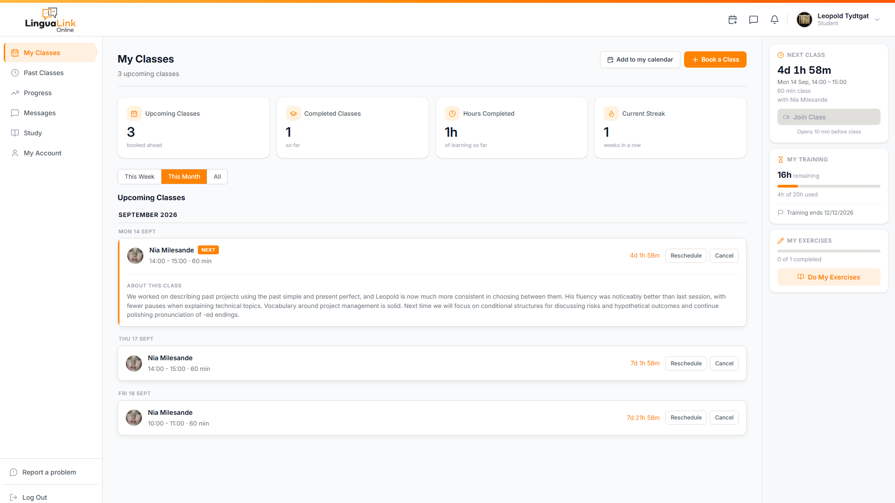
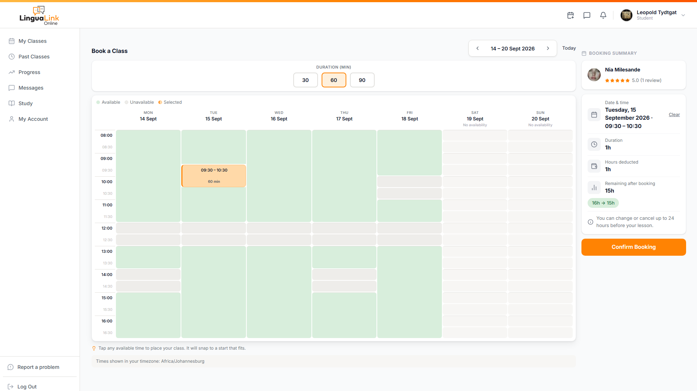
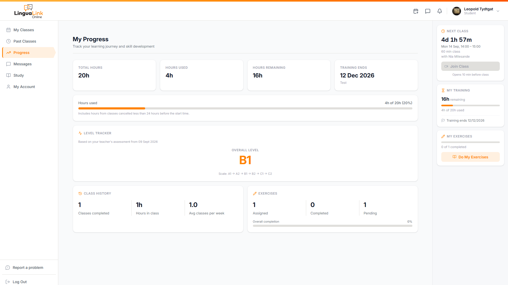
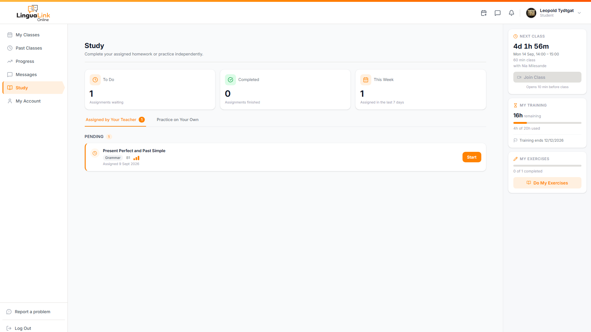
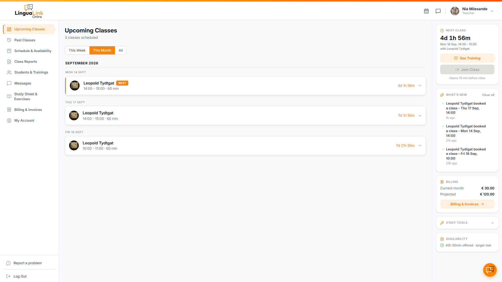
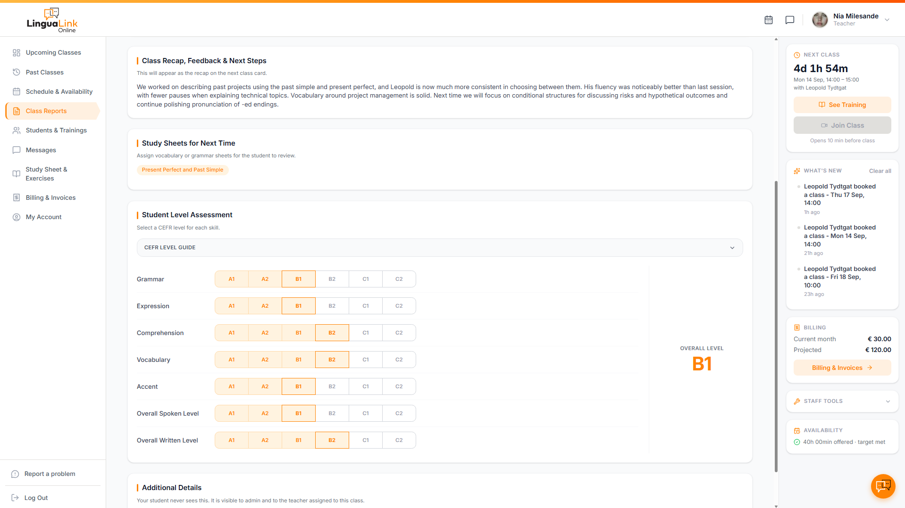

# LinguaLink LMS - Production Language School Platform

A custom learning management system running in production for a real language school, serving paying students and working teachers daily. Built, secured, and operated by one person.

  

> **Note:** The production repository is private. This showcase contains the case study, architecture, and selected sanitised excerpts. All screenshots and demos use seeded test accounts only.

---

## The 30-second version

A language school was paying for a third-party classroom platform that could not match how the business actually works. I replaced it with a custom platform: three portals (teacher, student, admin), automated Microsoft Teams class links, booking with atomic hour-balance accounting, teacher pay calculation, and a self-study library.

It launched in August 2026 and has run in production since, with real money and real schedules depending on it every day. I also built and maintain the client's public marketing site, so the delivery covers their entire online presence end to end.

**Watch it work:** [90-second overview](https://youtu.be/DxrWdP0GBIo)

**Stack:** Next.js (TypeScript) - Supabase (Postgres, Auth, RLS, Storage, Edge Functions) - Vercel - Microsoft Graph API - Google Calendar API - Resend - Sentry - GitHub Actions

---

## What changed for the business

- Students book their own classes against live teacher availability. Booking, cancelling and rescheduling deduct and refund hours automatically, so scheduling no longer passes through the admin.
- Student hour balances are enforced by the database, with a full transaction log of every top-up, booking, refund and adjustment. No more spreadsheet tracking.
- Teacher pay is calculated by the system from completed lessons and each teacher's rate. Month end is a review step, not a manual reconciliation.
- Microsoft Teams class links are generated automatically per lesson and stay stable through a substitute teacher swap. Students never have to chase a new link.
- Homework and self-study live inside the platform: teachers assign from a shared library, students complete and track it in their own portal.
- The business no longer depends on a third-party classroom platform. Video runs on the Microsoft 365 subscription it already had.
- The rules of the platform now belong to the business: cancellation windows, pay logic and who sees what are set by the client, not fixed by a vendor.

---

## What it does

- **Teacher portal:** schedule and availability, class reports with CEFR level tracking, student management, messaging, billing summaries
- **Student portal:** class booking against live teacher availability, hour balances, homework and self-study library, progress tracking
- **Admin portal:** full oversight - accounts, classes, reports, teacher pay, hour top-ups, study library management

## Architecture

### The parts I am proudest of

- **Row Level Security as the core security model.** Every table is locked down at the database layer. A student query physically cannot return another student's rows, regardless of application bugs. Sensitive admin-only columns are stripped at the grant level.
- **Atomic booking with idempotency keys.** Booking, cancelling, and rescheduling are single Postgres functions. Hours are deducted, refunded, and never double-spent, even on retries or double-clicks.
- **Stable Teams links.** Meeting links are tied to the lesson, not the teacher. A substitute teacher swap never changes the link a student already received.
- **Signed direct uploads.** File uploads bypass the hosting platform's body-size cap by uploading directly to storage with short-lived signed URLs.
- **Defence in depth.** CSRF origin gate, rate limiting, session revocation, and a completed security audit cycle with tracked findings.

**Technical walkthrough:** [3-minute deep dive](https://youtu.be/_QfQaxn1zBw)

### Screenshots

| | |
| --- | --- |
|  |  |
|  |  |
|  |  |

All screenshots use seeded test accounts.

---

## Key learnings - what broke and what it taught me

Real production taught me more than any tutorial. Three examples:

1. **`DROP FUNCTION` + `CREATE` silently resets Postgres EXECUTE grants.** A routine function recreate re-granted execute to roles that were deliberately revoked. Fix: an explicit re-revoke step after every function recreate, written into the standing migration checklist.
2. **Column-level grants fail silently.** A `select('*')` against a table carrying any column-level revoke returns null rows with no error at all. Cost me hours the first time. Rule now: explicit column lists on every sensitive table, and grant verification after every DDL change.
3. **Client-side error monitoring was dead for weeks and nothing looked wrong.** The monitoring DSN was missing the framework's public env prefix, so the client bundle silently shipped without it. The lesson: monitoring needs monitoring - proof of receipt, not just configuration.

More in the decision write-ups below.

---

## Decision write-ups (ADRs)

1. [Security model: Row Level Security as the primary boundary](adrs/01-row-level-security.md)
2. [Idempotency keys on the booking money-path](adrs/02-idempotency-keys.md)
3. [Monitoring and error tracking with Sentry](adrs/03-monitoring-and-error-tracking.md)
4. [Backup and disaster recovery approach](adrs/04-backup-and-disaster-recovery.md)
5. [Timezone handling across three portals](adrs/05-timezone-handling.md)

---

## How this was built

This system was built using AI-assisted development, with Claude as the delivery method. I designed the architecture and own the security model, the data model, the booking logic, testing, deployment and the ongoing operation of the platform, and I can explain and defend every production decision. This is what I do: build and operate multi-user business systems where permissions, scheduling, integrations, transactions and reliability matter.

---

## Cloud competency

The disciplines practised here map directly onto core cloud engineering work: least-privilege access control, observability, CI/CD, backup and recovery, and reliable operations. The full mapping, with AWS equivalents and certifications, is in [CLOUD_COMPETENCY.md](CLOUD_COMPETENCY.md).

---

## Legal

All rights reserved. This repository is published for portfolio evaluation only. No licence is granted to copy, reuse, or redistribute any part of it. The production system, its data, and its users are not linked from here.
