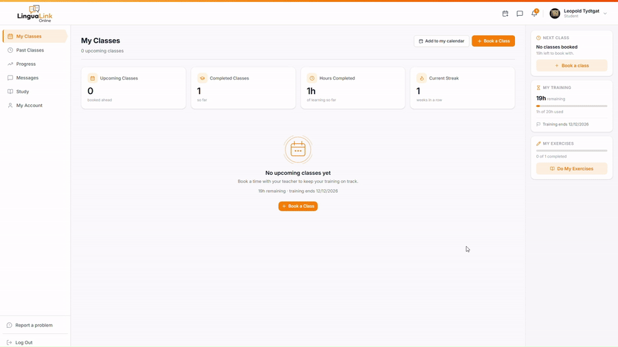
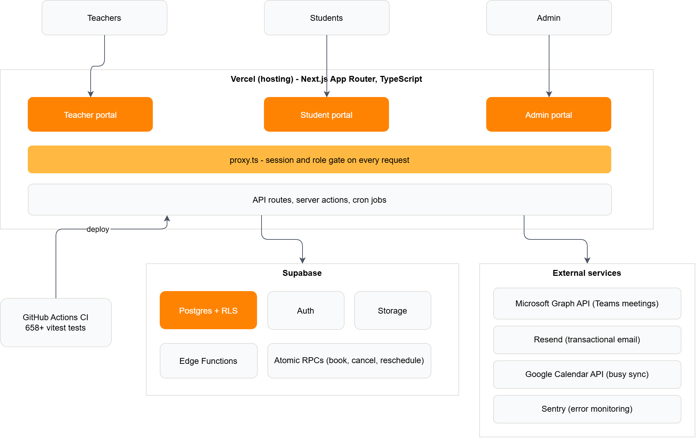

# LinguaLink LMS - Production Language School Platform

A custom learning management system running in production for a real language school, serving paying students and working teachers daily. Built, secured, and operated by one person.

  

> **Note:** The production repository is private. This showcase contains the case study, architecture, and selected sanitised excerpts. All screenshots and demos use seeded test accounts only.

---

## The 30-second version

A language school was paying for a third-party classroom platform that could not match how the business actually works. I replaced it with a custom platform: three portals (teacher, student, admin), automated Microsoft Teams class links, booking with atomic hour-balance accounting, teacher pay calculation, and a self-study library.

It launched in August 2026 and has run in production since, with real money and real schedules depending on it every day.

**Stack:** Next.js (TypeScript) - Supabase (Postgres, Auth, RLS, Storage, Edge Functions) - Vercel - Microsoft Graph API - Google Calendar API - Resend - Sentry - GitHub Actions

---

## The 3-minute version

### What it does

- **Teacher portal:** schedule and availability, class reports with CEFR level tracking, student management, messaging, billing summaries
- **Student portal:** class booking against live teacher availability, hour balances, homework and self-study library, progress tracking
- **Admin portal:** full oversight - accounts, classes, reports, teacher pay, hour top-ups, study library management

### Architecture

### The parts I am proudest of

- **Row Level Security as the core security model.** Every table is locked down at the database layer. A student query physically cannot return another student's rows, regardless of application bugs. Sensitive admin-only columns are stripped at the grant level.
- **Atomic booking with idempotency keys.** Booking, cancelling, and rescheduling are single Postgres functions. Hours are deducted, refunded, and never double-spent, even on retries or double-clicks.
- **Stable Teams links.** Meeting links are tied to the lesson, not the teacher. A substitute teacher swap never changes the link a student already received.
- **Signed direct uploads.** File uploads bypass the hosting platform's body-size cap by uploading directly to storage with short-lived signed URLs.
- **Defense in depth.** CSRF origin gate, rate limiting, session revocation, and a completed security audit cycle with tracked findings.

TODO: screenshot gallery (test accounts only)

---

## Key learnings - what broke and what it taught me

Real production taught me more than any tutorial. Three examples:

1. **`DROP FUNCTION` + `CREATE` silently resets Postgres EXECUTE grants.** A routine function recreate re-granted execute to roles that were deliberately revoked. Fix: an explicit re-revoke step after every function recreate, written into the standing migration checklist.
2. **Column-level grants fail silently.** A `select('*')` against a table carrying any column-level revoke returns null rows with no error at all. Cost me hours the first time. Rule now: explicit column lists on every sensitive table, and grant verification after every DDL change.
3. **Client-side error monitoring was dead for weeks and nothing looked wrong.** The monitoring DSN was missing the framework's public env prefix, so the client bundle silently shipped without it. The lesson: monitoring needs monitoring - proof of receipt, not just configuration.

More in the decision write-ups below.

---

## Decision write-ups (ADRs)

1. [Security model: Row Level Security as the primary boundary](adrs/01-row-level-security.md)
2. [Idempotency keys on the booking money-path](adrs/02-idempotency-keys.md)
3. [Monitoring and error tracking with Sentry](adrs/03-monitoring-and-error-tracking.md)
4. [Backup and disaster recovery approach](adrs/04-backup-and-disaster-recovery.md)
5. [Timezone handling across three portals](adrs/05-timezone-handling.md)

---

## Cloud competency mapping

Everything I practised on this platform maps directly onto core cloud engineering disciplines. This table is the bridge.

| What I did on LinguaLink | Cloud discipline | AWS equivalent |
|---|---|---|
| Row Level Security, column-level grants, role-gated API routes | Least-privilege access control | IAM policies, resource policies |
| Sentry with proof-of-receipt verification (found and fixed a silently dead client DSN) | Observability and alerting | CloudWatch, X-Ray |
| GitHub Actions CI gating every deploy behind 658 automated tests | CI/CD pipelines | CodePipeline, CodeBuild |
| Scheduled backups plus a documented restore path | Backup and disaster recovery | AWS Backup, RDS snapshots |
| Cron jobs for reminders and calendar sync, with failure monitoring | Scheduled and event-driven workloads | EventBridge, Lambda |
| Idempotent atomic operations on the booking money-path | Reliable distributed operations | SQS idempotency patterns, DynamoDB conditional writes |
| CSRF origin gate, rate limiting, session revocation, audit cycle | Defense in depth | WAF, security groups, GuardDuty mindset |
| Secrets kept in environment config, never in code, secret scanning enabled | Secrets management | Secrets Manager, Parameter Store |

The concepts transferred here are platform-independent: the same least-privilege thinking, the same "monitoring needs monitoring" lesson, the same recovery-path discipline. I am currently studying for the AWS Solutions Architect Associate (SAA-C03) certification. I already hold CompTIA A+ and Network+.

---

## How this was built

I am not a traditional developer. I architected this system and directed AI tooling (Claude) to implement it, while owning every decision myself: the security model, the data model, the booking logic, the operational practices, and every line that ships. I can explain and defend any part of this system without assistance.

---

## Legal

All rights reserved. This repository is published for portfolio evaluation only. No licence is granted to copy, reuse, or redistribute any part of it. The production system, its data, and its users are not linked from here.
